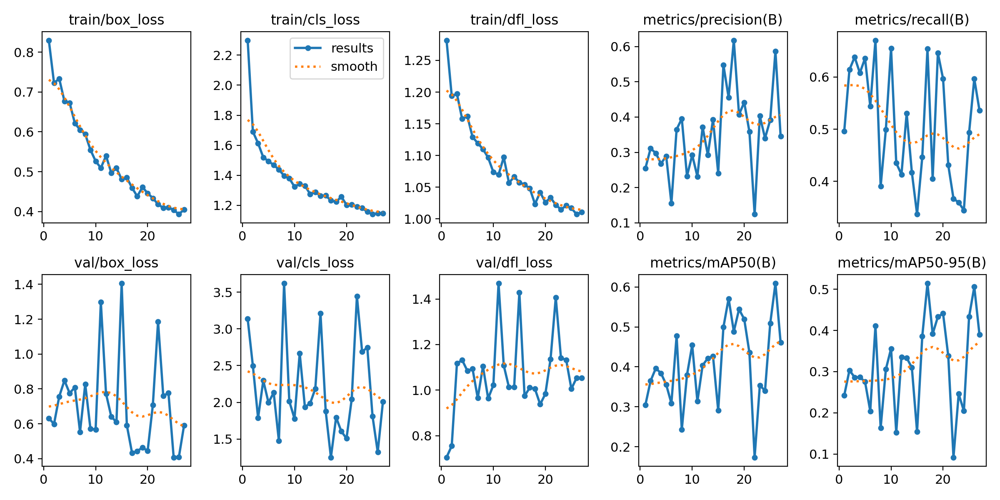
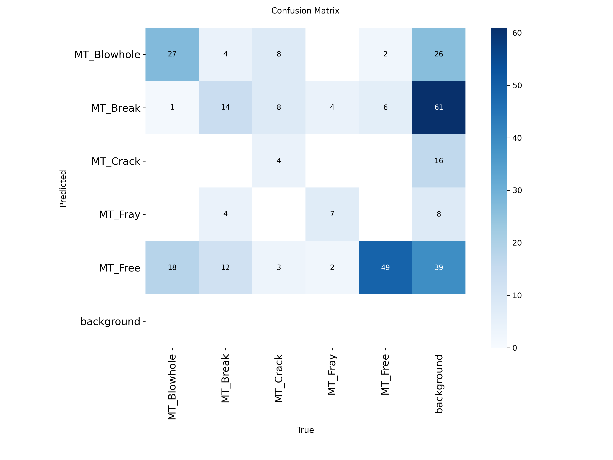

# 🏭 AI Visual Quality Inspector

An industrial-grade AI system that automatically detects 
surface defects in magnetic tiles using Computer Vision 
and generates detailed inspection reports with real-time 
analytics dashboard.


---

## 🎯 Project Overview
This system replicates real-world manufacturing quality 
control pipelines used by companies like Tesla, Samsung, 
and BMW — built entirely with free, open-source tools.

The system automatically:
- Scans product images for defects
- Generates detailed inspection reports
- Logs every inspection to a SQL database
- Displays live analytics on a dashboard
- Sends email alerts for critical defects

---

## ✨ Features
- 🔍 **Real-time defect detection** using YOLOv8
- 📝 **Auto report generation** with severity assessment
- 🗄️ **SQL database** logging every inspection
- 📊 **Live dashboard** with analytics and charts
- 📧 **Email alerts** for HIGH severity defects
- ⚡ **Batch processing** for multiple images

---

## 🛠️ Tech Stack
| Component | Technology |
|---|---|
| Defect Detection | YOLOv8 (Ultralytics) |
| Computer Vision | OpenCV |
| Database | SQLite + SQLAlchemy |
| Dashboard | Streamlit + Plotly |
| Email Alerts | SMTP + Gmail |
| Language | Python 3.10+ |

---

## 📊 Model Performance
| Metric | Score |
|---|---|
| mAP50 | 62.6% |
| Recall | 78.7% |
| Precision | 46.1% |
| Inference Speed | 39.5ms/image |

---

## 🏭 Defect Classes Detected
| Class | Description | Risk Level |
|---|---|---|
| MT_Blowhole | Air holes in tile surface | Medium |
| MT_Break | Physical breaks/fractures | High |
| MT_Crack | Surface cracks | High |
| MT_Fray | Fraying edges | Low |
| MT_Free | No defect — passes QC | None |

---

## 📁 Project Structure
```
ai-visual-quality-inspector/
│
├── main.py                 # Batch inspection runner
├── training.py             # YOLOv8 model training
├── generate_labels.py      # YOLO label generator
├── report_generator.py     # Inspection report generator
├── database.py             # SQL database setup
├── dashboard.py            # Streamlit dashboard
├── email_alerts.py         # Email alert system
├── test_email.py           # Email testing script
├── README.md               # Project documentation
├── .gitignore              # Git ignore rules
│
└── model/
    └── magnetic_tile_detector/
        ├── results.png         # Training results
        ├── confusion_matrix.png
        └── ...
```

---

## 🚀 How To Run

### 1. Clone the repository
```bash
git clone https://github.com/derindevis/ai-visual-quality-inspector.git
cd ai-visual-quality-inspector
```

### 2. Create virtual environment
```bash
python -m venv venv
venv\Scripts\activate
```

### 3. Install dependencies
```bash
pip install ultralytics opencv-python streamlit sqlalchemy pandas plotly
```

### 4. Download Dataset
Download from Kaggle:
👉 https://www.kaggle.com/datasets/wenzhao/surface-defect-detection-dataset

Extract and place in `dataset/` folder

### 5. Prepare dataset
```bash
python generate_labels.py
```

### 6. Train model
```bash
python training.py
```

### 7. Run single inspection
```bash
python report_generator.py
```

### 8. Run batch inspection
```bash
python main.py
```

### 9. Launch dashboard
```bash
streamlit run dashboard.py
```

---

## 📧 Email Alerts Setup
1. Enable 2-Step Verification on Gmail
2. Generate App Password at myaccount.google.com/apppasswords
3. Update `email_alerts.py`:
```python
SENDER_EMAIL    = "your_gmail@gmail.com"
SENDER_PASSWORD = "your_app_password"
RECEIVER_EMAIL  = "receiver@gmail.com"
```

---

## 📸 Project Screenshots

### Dashboard


### Training Results


---

## 🏆 Results
After training on 863 images across 5 defect classes:
- Model successfully detects all 5 types of magnetic tile defects
- Processes each image in under 40ms
- Automatically classifies severity as HIGH, MEDIUM or LOW
- Generates detailed reports with location and recommendations
- Dashboard shows real-time analytics of 396+ inspections

---

## 🔮 Future Improvements
- [ ] Live webcam feed for real-time inspection
- [ ] User login system for dashboard
- [ ] Cloud deployment on Streamlit Cloud
- [ ] Mobile app for remote monitoring
- [ ] Integration with conveyor belt systems

---

## 👨‍💻 Author
**Derin Devis**
- 🎓 AIML student
- 📅 Duration: Dec 2025 — Mar 2026
- 🔗 GitHub: github.com/derindevis

---

## 🙏 Acknowledgements
- **Ultralytics** for the amazing YOLOv8 framework
- **Kaggle** for the Surface Defect Detection Dataset
- **Streamlit** for the dashboard framework

---

## 📄 License
This project is open source and available under the 
[MIT License](LICENSE)
